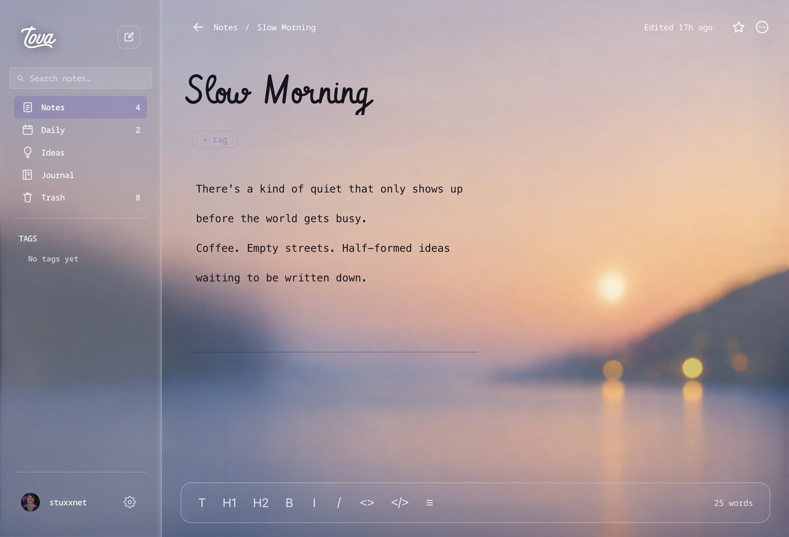

# Tova

A calm, local-first writing app for macOS. Markdown notes that stay markdown,
a daily note that writes itself, and a way to put a post on your blog without
leaving the window.



## Why Tova?

- A lightweight note-taking app.
- **Still powerful.** Write several posts in a single note, each with its own
  `@` block, and publish them from where you wrote them. Configure as many blogs
  as you like and pick the target as you write.
- **Can be 100% offline and private**, if you want — including vaults encrypted
  at rest, one folder at a time.
- **Everything else you would expect is here:** daily notes, tags, spellcheck,
  sections you can rename and reorder, full-text search, live preview with no
  pane or toggle, autosave as you type, dated snapshots of the whole vault, and
  export to markdown or PDF.

## Not built yet

Deferred on purpose rather than left undone, and each for a reason:

- **Purging a tag.** Write under different tags in one file, and delete
  everything under one of them — you leave your job, say — without losing the
  rest. The appeal is obvious; the danger is too, and a one-click delete of an
  unknown number of notes wants more thought than it has had.
- **Managing several vaults from Settings.** Tova holds as many as you like and
  switches between them; the Vault tab shows the one that is open rather than
  listing them all.
- **Paging the snapshot list.** Every snapshot is there and restorable — the
  list just gets long.
- **A tip jar and a feedback form.** Both need a destination Tova does not
  have. The GitHub issues link is here instead.

## Delete Tova and your notes are still there

Everything lives in `~/Documents/Tova` as plain markdown, one file per note, in
folders you can see. Open them in any editor. Grep them. Put them in Dropbox.

Nothing is uploaded, there is no account, and the app works with the network
off. The only time Tova reaches the internet is when you ask it to publish.

### Unless you ask for a vault that isn't

A vault can be encrypted, and then it is not plain markdown any more — that is
the trade, and it is per vault, so you can keep the default one open and put
the sensitive writing somewhere sealed.

Every file in a sealed vault is encrypted with AES-256-GCM: notes, pictures and
older versions alike. **Filenames are not**, so a folder full of sealed notes
still shows its titles. The point is a vault you can leave in iCloud or Dropbox
without the service being able to read it, not a vault that hides that it
exists.

The key is kept in your Mac's keychain, so Tova opens the vault on this machine
without asking. Any other machine needs the **recovery key**, shown once when
you encrypt and never again — Tova keeps no readable copy of it. Lose that and
the keychain together and the notes are gone; nobody can get them back, which
is the whole point and also the risk.

## What it does

**Writes.** Live markdown — headings, bold, links and images render as you
type, and the syntax comes back when the cursor enters it. No preview pane, no
split screen, no mode to toggle. Code blocks are highlighted, spelling is
checked as you go, and there is a grammar checker that runs on your machine
rather than on someone's server — off by default, since it is 15MB of
WebAssembly that only loads if you want it.

**Organises.** Sections down the side — Notes, Daily, Ideas, Journal, whatever
you like — which you rename, reorder, re-icon, hide or add to. Tags are read
out of your prose rather than stored beside it, so `#writing` in a sentence is
a tag. Every section, folder and tag has an index page you can sort, with
favourites at the top.

**Finds.** Search reads titles, tags and the text of every note, ranked by
relevance rather than recency — a title you typed exactly beats the same word
buried in a paragraph.

**Publishes.** Mark a note with an `@` line and Tova commits it to your blog's
repository, then watches the deploy and tells you when it is live. Posts sync
back, so editing on either side is safe.

**Keeps.** Snapshots on a schedule you choose, restorable from Settings. Export
any note as markdown or PDF.

**Gets out of the way.** Light, dark or follow-the-system, each with its own
background photograph. Set the type, the line width and the title face — or
load a font of your own.

## Running it

```bash
pnpm install
pnpm run dev
```

`pnpm run check`, `pnpm run test` and `pnpm run build` are the verification
loop; all three stay green.

## Building

```bash
pnpm run tauri:build   # signed .dmg, ~14MB, into src-tauri/target/release/bundle/
pnpm run package       # the Electron build: signed .dmg for arm64 and x64, into release/
pnpm run icon          # regenerate build/icon.png from tools/icon-source.png
```

macOS only — there is no Windows or Linux target. Both sign from whatever
Developer ID is in the keychain; `tauri:build` wants it named in
`APPLE_SIGNING_IDENTITY`. Notarization is a separate step and `PROGRESS.md`
has it.

## Stack

Electron 42 · React 19 · TypeScript 6 (strict) · CodeMirror 6 · electron-vite 5
· Zustand · Vitest 4 · pnpm. Styling is hand-written CSS driven by design
tokens — no utility framework and no component library. The dependency list is
short on purpose.

## Structure

| Path            | What                                                      |
| --------------- | --------------------------------------------------------- |
| `src/main/`     | Filesystem, IPC, publishing — everything privileged       |
| `src/renderer/` | The interface, and the CodeMirror editor                  |
| `src/shared/`   | Types and pure logic both sides use                       |
| `docs/SPEC.md`  | What it is meant to do, and what was deliberately cut     |
| `PROGRESS.md`   | Current state, architecture notes, and the honest caveats |

## Licence

Source-available, not open source: you may read it, but no licence to use it is
granted. See [LICENSE](LICENSE). The bundled typefaces and photographs carry
their own terms and are unaffected.
